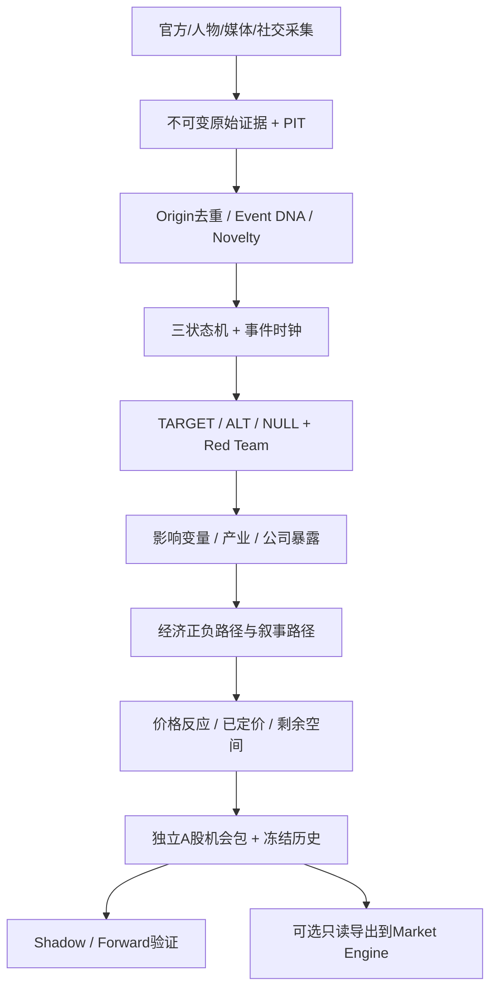

# X 独立事件驱动机会发现引擎 V0.1 总体技术规范

版本：V0.1；日期：2026-09-06；阶段：Phase 0 设计基线，业务代码未实施，真实 Alpha 未验证。英文标识符是机器契约，中文说明是面向用户的规范。`必须`为验收约束，`默认`为可配置工程假设；配置变化必须版本化。

## 1. 目标、边界与协议优先级

最终产出：**从全球新增事件中发现最可能获得正向重新定价的 A 股，并判断还有多少未完成定价。** 输出可解释、带证据、带反方与失效条件的《A股事件机会包》，不输出自动下单指令。映射质量、研究机会质量、账户执行资格和已验证收益是四个不同概念。

四协议统一关系：

| 协议 | 本规范对应章节 | 核心输出 |
|---|---|---|
| 信息源与关键人物注册 | §4 | 来源身份/用途、人物×主题、不可变证据 |
| 24小时事件发现与状态机 | §5—6 | Event DNA、事实/叙事/价格、版本和重算触发 |
| 事件→产业→A股公司传导图 | §7—8 | 经济/叙事分离、双向路径、公司暴露和证券映射 |
| 已定价程度与剩余定价空间 | §9—10 | 独立维度、机会等级、研究排名与反转风险 |

依据为原讨论 [X真实数据验收](https://chatgpt.com/c/6a9acc71-88c8-83ec-b093-697d2dfba678) 中四协议及后续用户修正。本文件将讨论里的示例字段归一化为实施标准，不把示例分数、半衰期或模型推荐当作实证事实。用户最新明确要求优先；本规范与未来实现出现歧义，应更新本规范并附迁移说明，不能暗改核心语义。

冻结原则：

- 事件引擎独立运行、存储、研究和验证，全天监听，不绑定 14:35 / 14:45 / 14:50。现有 Market Engine 的尾盘至 T+1 目标保留。
- 用户持仓、成本、喜好、担忧只可在研究结果冻结之后用于展示或账户资格，不能进入证据包、来源权重、分析提示词和 Alpha 排名。用户提示可作为待验证线索，必须自行检索证据；保留 `user_suggested` 标记。
- TARGET / ALT / NULL、反方证据、替代标的挑战必须可追溯。模型意见、事实、统计概率分别标识。
- 研究全部 A 股；创业板、科创板、北交所、ST、停牌仍留在研究分母。执行资格不得反向改变研究结论。
- Reality / Narrative 分开，正向、负向、中性、未知、混合都保存。β 叙事机会允许存在。
- PIT 是数据完整性约束；合理不确定性是研究维度，两者不能混用。不得为产生候选绕过 PIT，也不得以“未百分百确认”为由删除所有研究线索。
- 先复用小型成熟基础设施，领域逻辑保持 X 自主设计。开源审查按 [冻结矩阵](OPEN_SOURCE_REFERENCE_MATRIX_V0.1.md) 一次完成，后续仅遇明确阻塞才局部重审。

## 2. 独立子系统架构与交付边界

当前仓库基线及未合并 PR 见 [恢复报告](RECOVERY_REPORT.md)。`src/xalpha/`、旧配置、旧策略文档、标签公式和旧 CI 不因事件引擎变更。文档分支从 main 新建，不能误把 PR #2 顺带合入。

未来目录约定（本轮只创建 docs）：

```text
docs/event_engine/                     本规范、恢复、开源矩阵、路线图
subsystems/event_engine/
  pyproject.toml                       独立安装、锁依赖、CLI入口 x-event
  src/xevent/
    contracts/ registry/ evidence/ ledger/ discovery/
    states/ ontology/ exposures/ graph/ research/
    pricing/ ranking/ evaluation/ adapters/ runtime/
  tests/                               fixture、PIT、集成
  configs/                             无秘密的版本化策略
  migrations/                          有版本、可验证的DB迁移
```

独立进程以 Python 3.11/3.12 为初始兼容目标，具体包锁版本在首次引入时验证。V0.1 单机使用 SQLite + SQLAlchemy（一个写入者、事务/outbox），原始内容保存为本地不可变文件；大量行情导出需要时用 Parquet，分析需要时再引入 DuckDB，不为预期规模搭 Kafka、Spark、Kubernetes、Neo4j。PostgreSQL 是多写入者/长期服务的迁移目标，不是启动前置条件。数据库事务及迁移复用成熟实现，Event Ledger 的领域语义由 X 定义。



Collector → Evidence → Event → Research → Mapping → Pricing → Candidate 是版本化流水线，不要求串行等待全市场所有事件。只重算受影响对象。市场反馈可触发新版本，不能倒灌已冻结包。

未来 CLI 最小契约：`x-event ingest --fixture PATH`、`x-event run --once`、`x-event run --daemon`、`x-event inspect --event-id ID --as-of TS`、`x-event export --as-of TS`、`x-event shadow settle --run-id ID`。中文解释加稳定英文错误码。默认不开启服务/外部收费调用；mock/replay 和 live 明确分模式。服务将来可通过 Windows 计划任务/服务或自有服务器部署，关闭 ChatGPT 不影响独立服务；本轮不安装或启动任何后台服务。

## 3. 全域时间、版本和证据契约

### 3.1 类型和公共信封

ID 为稳定非空字符串；`version` 为正整数；代码为字符串保留前导零；时间为 RFC3339 带时区，存储统一 UTC，用户显示 Asia/Shanghai。未知数值为 `null` 加 `missing_reason`，不能用 0、空字符串、NaN 或想象值填充。列表为空必须区分“没有”和“未查”。枚举按用途分层，新增正式成员须升 `schema_version`：内部决策/状态枚举严格校验；外部输入分类保留安全兜底，规则如下。Pydantic 严格校验与 JSON Schema 生成复用库，不能自写通用校验框架。

枚举分层契约：

- **内部决策/状态枚举**：`fact_state / narrative_state / pricing_state / mapping_state / grade / impact_direction` 等仅接受各自规范已列成员，未声明值必须 FAIL_CLOSED，不静默纠正或映射成合法状态。部分枚举已声明的 `UNKNOWN` 是明确状态，不等于允许任意未知字符串；例如 `fact_state=NEW_UNLISTED_STATE` 必须拒绝。
- **外部输入分类枚举**：`statement_type / evidence_type / event_type` 等在已知成员之外必须支持 `UNKNOWN / OTHER`。无法确定分类用 `UNKNOWN`；已知原始类别但暂未纳入分类表用 `OTHER`。原始字段值按原样保存在所属对象的 `raw_type`（来源缺失时为 `null`，并记录原因）；不能只保存兜底成员而丢弃原始值。多个外部分类字段并存时使用按字段名区分的原始分类映射，不能互相覆盖。
- 外部适配层将未识别值显式规范化，内部模型只接受声明的成员及该类允许的兜底。未知发言场景不得仅因分类表不全而丢弃整条 Evidence；`UNKNOWN/OTHER` 不增加事实可信度、不默认确认主张，也不能绕过来源、引用、PIT和后续验证。原始证据安全摄取与正式推荐资格分开。


每个业务版本至少携带：

```text
object_id, version, schema_version, recorded_at, available_at,
effective_from?, effective_to?, supersedes_version?,
evidence_version_refs[], input_version_refs[], run_id, policy_version,
status, reason_codes[], content_hash
```

所有外键引用具体 `(object_id, version)`，不能只引用会变化的 latest。`content_hash` 使用 SHA-256，哈希用于完整性，不代表内容真实。用于语义去重的规范化哈希与原始字节哈希分开存。

### 3.2 时间含义与三种运行模式

| 字段 | 含义 |
|---|---|
| `occurred_at` | 事件声称发生的时间；可未知，不能作为系统可知时间 |
| `published_at` | 来源声明的发布时间，保留原文及时区精度，可能需核验 |
| `public_available_at` | 能证明该内容版本向公众开放的时间，及证明方式 |
| `first_seen_at` | 本系统首次实际观察到这个内容版本的时间 |
| `collected_at` | 形成该 Evidence 版本的原始响应完整接收时间；后续重抓另记采集记录，不覆盖该版本时间 |
| `ready_at` | 该原始 Evidence 版本完成解析、规范化与必需校验的时间；不等于事实已确认，也不代替持久化完成时间 |
| `recorded_at` | 该版本成功耐久化提交完成的时间；不是接收、入队、事务开始或提交请求时间 |
| `available_at` | 该具体版本满足就绪、耐久化及输入时间门槛后可进入正式研究的最早时间 |
| `computed_at` | 派生结果/模型输出实际完成时间 |
| `effective_from/to` | 现实有效区间，左闭右开，与可知时间独立 |
| `as_of` | 本次研究知识截止时间，任何工具和关联查询共同遵守 |

`LIVE_FORWARD` 原始 Evidence 统一使用 `ready_at` 表示解析/规范化/必需校验完成时间。正式研究可用时间必须满足：

```text
available_at >= max(first_seen_at, collected_at, ready_at, recorded_at)
```

这四个时间是合格 Evidence 版本的必需字段。尚未就绪、校验失败、提交失败或无法证明耐久化完成的内容只能留在原始接收/待处理区，不可作为正式 Evidence 被 as-of 查询选中；不得把记录进入数据库的时间预填为提交完成时间。若来源时间核验发生异常则隔离异常元数据，不以未来发布时间覆盖实际记录。`published_at/public_available_at` 仅表述来源发布与公开可知，不能替代本系统的就绪/提交门槛。新发现旧公告只在当前可用。

派生对象（包括统计画像、模型结果、映射和排名）必须保存 `computed_at`，并满足：

```text
available_at >= max(all_input_available_at, computed_at, recorded_at)
```

`all_input_available_at` 为全部具体输入版本可用时间的最大值。14:50 开始、14:52 完成的 LLM 结果不能成为 14:50 的市场模型特征。

PIT边界示例（均为 `2026-09-06`、`+08:00`）：`first_seen_at=10:00:01`、`collected_at=10:00:02`、`ready_at=10:00:05`、`recorded_at=10:00:05`，因此 `available_at` 最早为10:00:05。`as_of=10:00:03` **不得看到该 Evidence**；只有实际发布可用且 `available_at <= as_of` 时才可见。若耐久化延迟到10:00:07，即使校验10:00:05完成，10:00:06仍不可见。每次新内容版本/更正均重新满足门槛，不复用旧版本的就绪或提交时间。

`OBSERVED_REPLAY`：只回放当时保存的具体证据和结果版本，按真实 `available_at <= as_of` 重建。当前新算结果不能冒充历史产出。

`PUBLIC_PIT_RESEARCH`：允许当前取得、但有不可变版本及可靠公开时间证明的历史档案。保存真实抓取时间、`public_available_at`、证明、模拟延迟和模拟产出时间，单独的 `research_available_at` 用于模拟。不得改写实际 `available_at`，不得与 Forward 指标混合。只有日期无时分的历史资料采用保守日期上界/次可知时点策略；无公开时间证明的记录可用于现在研究，不进入过去样本。

### 3.3 PIT 硬约束

1. 每次生成证据包、图、市场指标、排名、导出时都校验输入版本 `available_at <= as_of`（公共历史研究使用显式模拟字段），执行 SQL as-of join；不能只在最终出口校验。
2. 公司事实/证券/人物职位/行业映射需同时通过现实有效区间和知识截止。年报说明去年已存在的业务，不得回填到年报公开前。
3. 同一现实区间的新更正允许作为新知识版本保存；as-of 先选截止前可见版本，再解析有效区间和确定性优先级。不能修改旧行的结束时间而泄露后来纠错。
4. 编辑、删除、否认、合并、分裂、复活都追加记录。旧时间查询不知未来更正或未来合并，原始文本与证据引用仍可重现。
5. 行情来源时间、接收时间、单位、币种、交易所日历、时段、复权策略同样受控；禁止用当前前复权整段历史隐含未来公司行动。
6. 学到的来源可靠度、人物兑现率、行业字典修正、阈值、检索记忆和结果标签均为版本化输入；未来结算经验不得进入过去研究。
7. 当前 LLM 可能记得历史事件结局；历史模拟采用隔离证据包、禁止跨截止工具/记忆，记录模型版本与训练知识污染风险。盲测和日期截断不能证明模型无历史记忆污染，真实效力必须依赖 Forward。
8. PIT 失败隔离该记录/该候选并记原因；保存原始输入，其他合法事件继续。系统性时钟错误、存储不一致则停止发布新排名。

## 4. 协议一：Source / Actor / Evidence

### 4.1 来源、人物和传播角色

| 表/对象 | 必需领域字段（另加公共信封） |
|---|---|
| `sources` | `source_id, name_zh, platform, canonical_locator, identity_status, tier, roles[], access_method, retention_policy, enabled, terms_status, authorization_status, allowed_uses, raw_retention_allowed, access_restrictions` |
| `source_topic_profiles` | `source_id, topic_id, reliability_band, expertise_band, influence_band, diffusion_band, lead_time_stats?, evidence_refs[]` |
| `actors` | `actor_id, name_zh, entity_type(PERSON/INSTITUTION), organization_id?, role_title_zh?, term_effective_from/to, verified_accounts[]` |
| `actor_topic_profiles` | `actor_id, topic_id, policy_authority, corporate_authority, expertise_band, influence_band, statement_count, realized_count, partial_count, denied_count, unresolved_count, outcome_available_at?` |
| `narrative_source_profiles` / `NarrativeSourceProfile` | `source_id, category, topic_id, followers?, originality?, citation_rate?, leading_stats?, following_stats?, posthoc_stats?, edit_stats?, delete_stats?, sample_n, observation_window, available_at, evidence_refs[]` |
| `statements` | `actor_id?, source_id, topic_id, statement_type, raw_type?, claim_kind, policy_certainty, market_shock_potential, evidence_ref` |


`NarrativeSourceProfile` 纳入 Phase 1 核心 Schema。`topic_id` 表示画像统计的主题作用域；`observation_window` 明确起止时间，`sample_n` 为非负有效样本数，未知指标保留 `null`。画像主要服务 Narrative / Diffusion / Lead-Lag，不以粉丝数替代事实可信度。领先/跟随/后验解释、编辑/删除、人物兑现等统计必须按输入证据和结果的可用时间版本化：保存具体输入/证据引用、`computed_at/recorded_at/available_at`，遵守派生对象时间公式；未来才获知的结果不得回填过去画像或过去来源权重。

Source 数据使用元数据仅纳入本Phase契约，不扩建授权系统：`terms_status = UNKNOWN / REVIEWED / UNAVAILABLE`；`authorization_status = UNKNOWN / AUTHORIZED / NOT_REQUIRED / DENIED`；`allowed_uses` 为用途列表（`null`表示未知，空列表表示无已允许用途）；`raw_retention_allowed` 为 `true/false/null`（`null`表示UNKNOWN）；`access_restrictions` 为限制说明列表（`null`表示未知）。未经核实不得从“公开可访问”推断可无限抓取、永久保存或商业使用，UNKNOWN不是授权；明确的限制/拒绝不得忽略。**开源代码许可证与数据/API使用条款分别记录、分别判断**，MIT/Apache等代码许可不授予所访问数据的使用权。这里只记录元数据和未知状态，不在Phase1安装采集依赖或启动采集。

来源层级：`S0` 原始事实文件；`S1` 决策人物/机构发言；`S2` 专业媒体；`S3` 专家/大V；`S4` 广泛社交。用途枚举 `FACT / POLICY_INTENT / EXPLANATION / NARRATIVE / DIFFUSION`，支持多用途。账号认证只能确认身份，不能确认每条主张。人物必须“人物×主题”评价，禁止永久单一人物总分。粉丝数不是事实置信度。

`claim_kind = FACT / INTENT / FORECAST / OPINION / RUMOR / NARRATIVE`；`statement_type = LEGAL_DOCUMENT / POLICY_NOTICE / PRESS_CONFERENCE / SPEECH / HEARING / INTERVIEW / INFORMAL_QA / SOCIAL_ORIGINAL / REPOST / LIKE / ANONYMOUS_REPORT / UNKNOWN / OTHER`。政策确定性与市场冲击分开。大V类别为 `INDUSTRY_LEADER / EXPLAINER / ATTENTION_MOVER / FOLLOWER / NOISE`，动态统计不能反向污染历史权重。小样本兑现率显示分子/分母和区间，不称为稳定概率。

### 4.2 不可变证据

`EvidenceVersion` 必需：`evidence_id, version, source_id, canonical_url_or_locator, original_language, raw_object_ref, raw_content_hash, first_seen_text_ref, origin_cluster_id, is_first_hand, independence_status, claim_kind, published_at?, public_available_at?, first_seen_at, collected_at, ready_at, recorded_at, available_at, evidence_type, raw_type?, quality_status`。

编辑/删除通过 `EvidenceChange(change_type=EDIT/DELETE/RETRACT, observed_at, prior_version_ref)` 追加，`latest_text` 只是视图。`EvidenceRelation(subject_ref, evidence_ref, relation=SUPPORTS/CONTRADICTS/CONTEXT, quoted_span, interpretation_zh)` 保留具体引用段和定位。来源不能抓到全文时保存可用摘要/URL及限制，不能伪造原文。

Reuters 原报道被 20 媒体和 50 账号传播：已确认原始证据数仍为 1，媒体扩散 20、社交扩散 50；原始源不明时 `independence_status=UNKNOWN`，不能假定独立。S3 有可验证一手材料时，对材料验真，不自动把其所有话升级成事实。

## 5. 协议二：Event DNA、Ledger 与发现

`EventVersion` 必需：`event_id, event_version, title_zh, event_type, raw_type?, dna, first_public_at?, first_seen_at, last_material_update_at, fact_state, narrative_state, pricing_state, clock, priority, lifecycle_status, event_cluster_ids[], evidence_refs[], hypothesis_set_ref?, revision_reason`。

`dna = {actor_ids[], action_code, object_entity_ids[], target_entity_ids[], domain_ids[], geographic_scope[], temporal_scope, identity_rule_version}`。DNA 是查重候选键，不是不可更改的 ID；无法识别主体时使用显式 unresolved 实体，不猜公司代码。

`EventLedgerEntry = {entry_id, event_id, sequence_no, previous_version, new_version, operation, trigger, evidence_refs[], reason_zh, recorded_at, available_at, run_id, idempotency_key}`。每事件唯一序号，事务内以 expected_version 做并发控制；Ledger、实体版本、重算 outbox 同事务。重复提交返回原结果；失败不得半写事件/重复发布。关系表保存版本化因果图，不依赖自研存储引擎。

Novelty 枚举及处理：

| 级别 | 判定 | 处理 |
|---|---|---|
| `R0_DUPLICATE` | 同源同版本完全重复 | 幂等摄取，不新增独立证据或深度推理 |
| `R1_DIFFUSION` | 无新事实、有新传播 | 更新传播；仅显著加速触发一次研究 |
| `R2_MINOR` | 非实质细节 | 新事件版本，按受影响范围轻量更新 |
| `R3_MATERIAL` | 新一手证据、数字、时间、对象 | 更新假设并重算受影响映射/候选 |
| `R4_MUTATION` | 性质改变，如意图成为法律 | 全事件假设、路径、剩余空间重算 |
| `R5_COUNTEREVIDENCE` | 否认、撤回、重要反证 | 最高优先处理；立即暂停旧推荐的有效标记，完成复核后发新版本 |

先精确来源/哈希查重，再相似度提供候选簇，最后按 DNA 与证据裁定合并；相似度不能直接证明同源或同事件。语义冲突保留独立事件待复核。只由旧内容重复传播组成的 R0 不新造 Alpha；真实新传播 R1 可产生 β。

`MERGE / SPLIT / MUTATE / ARCHIVE / REACTIVATE` 全部追加 lineage（原 ID、新 ID、原因、时间、映射）。归档非删除；新实质事实可复活。簇仅表达共同主题，不把同源事件分数相加；重叠候选保留全部事件来源。

持续采集但有变化才深度推理。工程初值：S0/S1 1—3 分钟，S2/S3 2—5 分钟，S4 聚合 5—15 分钟；优先遵守来源 API 限额和可用性，公开标注延迟、覆盖率和盲区，不保证“全网实时”。第一轮仅官方/公告/RSS加一个获授权的社交入口；访问不可用记 `SOURCE_UNAVAILABLE`，其他源继续。连接、RSS解析、重试复用矩阵组件。

## 6. 三状态机、时钟与触发规则

三维独立保存；事件价格状态是可选聚合摘要，具体价格判断必须以 `(event_id, security_id, as_of)` 保存，禁止所有相关股票共享一个定价结论。缺数据采用 `UNKNOWN`，不是“无反应”。

| 维度 | 合法状态及中文 |
|---|---|
| `fact_state` | `UNVERIFIED` 未验证、`PLAUSIBLE` 初步可信、`PARTIALLY_CONFIRMED` 部分确认、`INDEPENDENTLY_CONFIRMED` 独立确认、`OFFICIALLY_CONFIRMED` 官方确认、`IMPLEMENTED` 落地、`CONTRADICTED` 出现反证、`INVALIDATED` 否定 |
| `narrative_state` | `UNKNOWN` 未知、`SILENT` 静默、`EXPERT_DISCOVERY` 专业圈发现、`EARLY_DIFFUSION` 早期、`RAPID_DIFFUSION` 加速、`MAINSTREAM` 主流、`CROWDED` 拥挤、`DECAYING` 衰减 |
| `pricing_state` | `UNKNOWN` 未知、`NO_REACTION` 无明显反应、`INITIAL_REACTION` 初步、`PARTIAL_REPRICING` 局部重估、`SECTOR_DIFFUSION` 行业扩散、`FULLY_PRICED` 充分定价、`OVERTRADED` 过度交易 |

事实转换由主张和证据驱动：UNVERIFIED→PLAUSIBLE 需来源可追溯且主张合理；→PARTIALLY_CONFIRMED 需部分主张被验证；→INDEPENDENTLY_CONFIRMED 默认至少两个独立 origin（同源转述不计）；→OFFICIALLY_CONFIRMED 需负责机构对应正式确认；→IMPLEMENTED 需执行证据。一个有效官方文件可直接完成确认，不强制等待每个中间状态。确认“某人说了 X”不等于确认“X 已实施”。任何非否定状态可因相关强反证转 CONTRADICTED；核心主张被证伪转 INVALIDATED。反证解除必须新证据和复核，不能靠时间自动恢复。

叙事和价格可跳转、降级、反转；每次变化必须引用截至当时的覆盖统计/价格指标、规则版本及解释。阈值放配置并在训练窗内校准，禁止凭当前收益调整历史。价格不反应/上涨不能升级事实状态。长期无确认降低时效/置信度，不自动等于事实错误。

`EventClock = {age_wall_seconds, age_trading_minutes?, last_material_update_at, last_confirmation_at?, last_market_reaction_at?, persistence_band, half_life_estimate?, next_review_at, next_catalyst_at?}`。持续性枚举 `MINUTES / HOURS / OVERNIGHT / ONE_TO_THREE_SESSIONS / MEDIUM_TERM / STRUCTURAL / UNKNOWN`；半衰期为研究假设，不能定时销毁已确认事实。

强制重算触发：新一手源、官方确认/否认、关键数字/生效日/对象改变、关键人物新表态、重要反证、跨资产新确认、行业異动、传播突增、产业路径改变、首选映射错误、替代标的出现、价格状态显著变化。使用 `(event_version, evidence_packet_hash, policy_version, model_config_hash)` 缓存和幂等任务；传播抖动合并处理，反证不受普通冷却期阻塞。`P0` 系统重大、`P1` 行业重要、`P2` 观察、`P3` 背景；必须保留新颖度、影响、可信度、可映射性等维度。

## 7. 协议三：产业本体、公司暴露和图

### 7.1 节点与域表

经济路径：`EVENT → IMPACT_VARIABLE → INDUSTRY_SEGMENT → BUSINESS_EXPOSURE → COMPANY → SECURITY`。允许多个有证据支持的影响变量和产业环节；利润/订单/成本传导写入边的机制。叙事路径：`EVENT → NARRATIVE_THEME → MARKET_ASSOCIATION → COMPANY → SECURITY`。叙事路径不强制补造经济变量。

| 对象 | 必需领域字段 |
|---|---|
| `ImpactVariable` | `impact_id, event_ref, variable_type, direction, scope, magnitude_band, start_horizon, persistence_band, inference_type, confidence, evidence_refs[]` |
| `IndustrySegment` | `industry_id, name_zh, parent_id?, level, aliases[], ontology_version, external_crosswalks[]` |
| `NarrativeTheme` | `theme_id, name_zh, related_industry_refs[], association_evidence_refs[]` |
| `Company` | `company_id, legal_name_zh, aliases[], identity_evidence_refs[]` |
| `Security` | `security_id, company_id, symbol, exchange, board, currency, listed_from, listed_to?, status, PIT字段` |
| `CompanyExposure` | `exposure_id, company_id, industry_id, product_zh, economic_roles[], geographic_exposure[], customer_refs[], supplier_refs[], metrics[], effective_from/to, available_at, evidence_refs[], verification_state` |
| `ExposureMetric` | `metric_type, value?, unit, period_start/end, reporting_scope, currency?, source_span, evidence_ref, missing_reason?` |

影响变量按类型与方向拆字段，禁止混用 `DEMAND_UP` 和 `DEMAND+UP` 两套存储；展示可组合。类型：`DEMAND / SUPPLY / OUTPUT_PRICE / INPUT_COST / ORDER / CAPEX / MARKET_SHARE / IMPORT_SUBSTITUTION / EXPORT_OPPORTUNITY / SUBSIDY / REGULATORY_PRESSURE / FINANCING_COST / FX / RISK_PREMIUM`。方向 `UP / DOWN / FLAT / UNKNOWN`；FX 必带币种对、报价方向及公司收入/成本币种后才能解释利好。`inference_type = OBSERVED / HYPOTHESIS`，供应减少不自动成为价格上涨事实。

`economic_roles` 至少支持 `PRODUCER / CONSUMER / UPSTREAM_SUPPLIER / DOWNSTREAM_CUSTOMER / RESOURCE_OWNER / EQUIPMENT_SUPPLIER / SERVICE_PROVIDER / SUBSTITUTE / COMPETITOR / DISTRIBUTOR / CAPEX_BENEFICIARY`。X内部产业本体独立于申万/中信/证监会 crosswalk；概念主题不能占据真实产业或业务字段。

占比使用小数及分母定义。收入占比、利润占比、订单占比、产能占比不可互代；只有分子分母同口径、同期间且分母有效时才计算，负利润/零分母另标不可解释，禁止机械限制后误算。纯度缺失保留 UNKNOWN，不能让 LLM 捏造“63%”。历史重组/更名、A/H多证券和退市均按公司与证券分别保存。

### 7.2 Edge / Path 机器契约

`EdgeVersion = {edge_id, version, from_ref, to_ref, edge_type, world, impact_direction, strength_band, causal_confidence, mechanism_zh, inference_type, evidence_refs[], origin_cluster_ids[], effective_from/to, available_at, status}`。

`world = ECONOMIC / NARRATIVE`；`impact_direction = POSITIVE / NEGATIVE / MIXED / NEUTRAL / UNKNOWN`，这是目标受影响方向，不能与变量 UP/DOWN 混用。边类型：

- Event/Impact 间：`CAUSES / INCREASES / DECREASES / ENABLES / RESTRICTS`。
- Impact/Industry 间：`BENEFITS / HARMS / RAISES_DEMAND_FOR / RAISES_COST_FOR / REDUCES_SUPPLY_OF / INCREASES_CAPEX_FOR`。
- Industry/Exposure 连接使用 `HAS_EXPOSURE`，业务角色由 Exposure 及其机制字段约束；公司/产品业务关系另用 `PRODUCES / CONSUMES / SUPPLIES / BUYS_FROM / SELLS_TO / COMPETES_WITH / SUBSTITUTES_FOR / OWNS_RESOURCE / SERVES`，按语义方向连接，不因绘图方便颠倒生产者/消费者。
- Exposure→Company `EXPOSURE_OF`，Company→Security `HAS_SECURITY`；Event→Theme `EVOKES_THEME`，Theme→Association `HAS_ASSOCIATION`，Association→Company `MARKET_ASSOCIATED_WITH`，均保留当前/历史传播证据。`MarketAssociation` 至少含 association_id、theme_ref、company_ref、证据版本及可知时间。

`TransmissionPath = {path_id, version, event_ref, company_ref, security_ref, world, node_refs[], edge_refs[], graph_hop_count, economic_depth, impact_direction, benefit_level, evidence_refs[], mapping_state}`。节点/边相邻必须一致，不能悬空；经济因果链不得循环论证。`economic_depth` 指经济传导层数，不把公司到证券的结构边计入；默认 L1/L2/L3，超过3层软降置信度，不自动删除。等级 `L1_DIRECT / L2_FIRST_ORDER / L3_SECOND_ORDER / N1_NARRATIVE / REJECT_WEAK_MAPPING`。叙事链只能 N1，不能靠高传播分变成 L1。

每个关键业务事实必须有公司披露/年报/招股书/公司官网/IR等可验证定位。经济机制可是假设，但明确标记及列出支持依据，不能让“某边有一条证据”替代整条关键事实链验证。未知业务可进待证实的 `PLAUSIBLE`，不能输出 `VERIFIED_DIRECT`。经济事实被否定则经济路径失效；只有独立可追溯的真实市场关联仍存在时，才可另建 β 叙事路径，必须突出否认，不能偷偷改名逃避反证。

候选同时保存 `positive_path_refs[], negative_path_refs[], narrative_path_refs[], net_effect_state`。正强、负中强应输出 MIXED，不计算虚假的 +80−60=+20。映射状态 `VERIFIED_DIRECT / VERIFIED_INDIRECT / PLAUSIBLE / NARRATIVE_ONLY / MIXED / CONTRADICTED / INVALID`；这些状态不等于最终机会等级。

## 8. 独立研究及结构化模型边界

先确定性检索 PIT 证据包，再调用可配置模型。历史讨论中的特定模型名称是偏好，不等于已核实 API 型号或配额；提供 `provider/model` 配置、成本上限、mock 实现，后续 Phase 才验证实际可用型号。本轮不调用付费分析、不训练 FinGPT、不导入整套多代理交易框架。

`ResearchPacket = {packet_id, as_of, mode, event_ref, evidence_versions[], exposure_versions[], market_observation_refs[], search_coverage, unresolved_questions[], packet_hash}`，不含用户持仓偏好。来源文本作为不可信数据，不允许其中指令更改工具权限或系统规则。

`HypothesisSet` 必含 TARGET、至少一个 ALT、NULL；各自有具体可证伪陈述、支持/反对证据、当前判断、下一验证条件。`RedTeamReport` 必含最强反方证据、最可能亏损/失败路径、替代因果、核心假设弱点、失效条件和替代公司比较。优先搜索 2—5 个可比标的；只有1个/找不到时记录搜索范围和原因，不编造替代者、不因此硬拒绝。

推荐过程：先独立研究形成结论并冻结，再展示用户关注；主研究与反方审查分上下文/角色，最后按证据裁定。可使用同一模型，不能声称角色分离等于统计独立；分歧原文留存。P0/P1重大更新及任何进入 α1/α2/β 的候选都需完成反方审查。找到零条真实反证可写“未找到”，仍需具体失败假设及查询记录，禁止模板“市场有风险”。

模型只提取主张、提出经济机制/假设、解释证据、挑战候选；代码负责数字、Schema、引用存在性、证券映射、单位、PIT、图、版本与排序。输出引用缺失/JSON非法/杜撰数字则拒收该结果；原始模型响应存审计区，最多有限修复/重试，不能无限辩论。默认一次主分析、一次 Red Team、必要时一次裁定；无实质变化复用结果。预算耗尽标 `ANALYSIS_PENDING/HOLD`，旧有效包带时间继续可查，不能把旧结果伪装新结论。

## 9. 协议四：市场认知、已定价与剩余空间

每只候选保存独立向量，不能只保留总分：事件可信度/新颖度/预期变化、真实受益、纯度、利润弹性、市场认知、价格反应、行业扩散、叙事扩散、跨资产确认、拥挤、新增买方、剩余生命、剩余空间、反转风险、证据覆盖。

`MarketObservation` 包含 `security_id/asset_id, provider, event_time, received_at, available_at, price, currency, price_adjustment, volume, volume_unit, turnover, turnover_unit, session, quality_status`。

`PricingAssessment = {event_ref, security_ref, as_of, anchor, windows[], benchmark_refs[], measures[], recognition_band, pricing_state, price_in_band, crowding_band, cross_asset_state, next_buyer_hypotheses[], persistence_band, remaining_edge_band, reversal_risk_band, assumptions[], counter_refs[], missing_dimensions[]}`。

确定性指标：

- 同币种同口径 `r_stock = P(t)/P(t0)-1`；`AR_market = r_stock-r_market`，行业/同业同理。简单超额收益不是因果事件收益；如用 beta 残差，beta 仅用事件前训练窗拟合并留参数版本。
- 锚点优先首次公开前最后可用可比价格；如果首次公开不可核实，显式切换 first_seen 锚点并说明局限。另查事件前趋势以发现提前交易。观察窗终点不能超出 as_of。
- 量额倍数以历史相同时段/季节性基准，记录分母窗口及样本数；半天成交量不能直接比完整日均值。没有主动买盘数据不能从 OHLCV 编造。
- 行业上涨占比、跑赢占比、中位数、前20%强度使用 PIT 成分，分母/缺数一起报告。共源传播不算独立事实。
- 叙事传播按来源数、增速、跨平台、关注群体记录覆盖偏差；跨资产 `CONFIRMED / PARTIAL / UNCONFIRMED / OPPOSITE / UNKNOWN` 结合交易时段、汇率与有效新鲜度。
- A股闭市采用上一有效报价并标陈旧；海外确认不等于A股开盘可成交，不能据陈旧A股价推断“尚未定价”。

`price_in_band = LOW / MEDIUM_LOW / MEDIUM / MEDIUM_HIGH / HIGH / OVERPRICED / UNKNOWN`；`remaining_edge_band = NONE / LOW / MEDIUM / HIGH / VERY_HIGH / UNKNOWN`；风险 `LOW / MEDIUM / HIGH / VERY_HIGH / UNKNOWN`。这些是研究分级，不是“已定价67.4%”或胜率。研究 `confidence` 若用0—1必须带 `confidence_kind=RESEARCH_JUDGMENT`，只有有校准集/样本/方法的统计概率才可用 `CALIBRATED_PROBABILITY`。

剩余空间综合事件强度、经济或叙事机制、认知差、价格反应、新买方假设、生命周期、拥挤和风险，不是 `100-price_in`。新增买方分类机构/主题资金/ETF/量化/产业资金/散户等只是可证伪假设，必须解释为什么尚未入场，不能声称观察到真实身份资金流。

高认知低反应触发 `NON_REACTION_INVESTIGATION`：比较低估与映射错误两种解释。上涨触发 `ALTERNATIVE_CAUSE_SEARCH`：排查指数、公司公告、其他事件和商品驱动。观察到共同上涨不能证明事件因果。缺跨资产数据、部分未确认、较长因果链一般降置信度；缺全部可比价格则保留映射、定价UNKNOWN，暂停正式高剩余空间结论。

## 10. 机会包、排名与合理风险

`CandidateVersion` 至少有：`candidate_id, version, event_ref, company_ref, security_ref, research_universe_version, channel, path_refs[], mapping_state, raw_dimensions, pricing_assessment_ref, research_ref, red_team_ref, grade, grade_reason_zh, research_rank?, rank_policy_version, execution_eligibility, execution_reasons[], available_at, expires_at?, invalidation_conditions[], change_from_previous`。

| 等级 | 最低解释标准，不代表已证明盈利 |
|---|---|
| `ALPHA1` / α1 | 可追溯的强经济路径、已核实核心公司暴露、高剩余空间判断及可接受风险；反方完成，无未解决致命反证 |
| `ALPHA2` / α2 | 合理经济受益、开始扩散或重估、仍有剩余空间；允许重要不确定性，明确触发/失效条件 |
| `BETA` / β | 有可追溯的新传播变化与市场关联、剩余叙事空间假设；经济受益弱/未知仍可；必须标高反转风险 |
| `WATCH` | 合理路径待条件、价格或数据补齐；明确升级条件，不强行凑推荐数 |
| `OVERPRICED` | 路径可成立但当前剩余赔率不足；不等于明天必跌 |
| `REJECT` | 该候选核心来源或映射不成立，保留原因与历史，不从审计分母删除 |

数据/处理状态另设 `READY / DEGRADED / HOLD / QUARANTINED`，不得把数据缺失等同经济逻辑 REJECT。硬边界与软降级：

- 不可追溯/伪造核心来源、无合理经济或叙事路径、仅名称相似、核心映射被明确事实否定：拒绝对应路径/候选，历史保留。
- PIT违规、悬空引用、证券身份歧义、原始哈希失败：隔离相关结果；拒绝发布该版本。
- 完全旧信息且无新事实/新传播：不生成新催化，但原事件可继续跟踪。
- 事实未完全确认、利润占比未知、来源少、跨资产未确认、叙事高风险、替代者不足：降低等级/排名或WATCH，不能全局一票否决。

V0.1 默认分组排序：经济与叙事分别排名；每组先 grade，再剩余空间带、证据覆盖、风险带（升序）、新颖度；最终以稳定 security_id 打破同分。UNKNOWN 排在同维已知值后，不能按0插补；展示不把 β 自动隐去。该排序是工程基线，Phase 9冻结精确 ordinal 映射和示例；不将讨论中的25%/30%等示例权重直接当训练结论。若加入分数必须配置化、保留贡献分项、只用训练窗调整，不承诺跨渠道分数可比。

机会包中文内容：事件及时间、已确认事实、未确认信息、TARGET/ALT/NULL、三状态、正负经济与叙事路径、候选排名、每只股票为什么可能重定价、已反应多少、剩余空间、新增买方、最强反方、替代标的、失效/升级条件、执行资格、数据缺口。空候选是允许结果；没有严格数据质量借口伪造推荐，也不以永远空榜为“低风险成功”。统计推荐覆盖率与过度过滤损失。

## 11. Research Universe 与 Execution Universe

`ResearchUniverseSnapshot(as_of, master_version, members[], expected_count?, observed_count, missing_count?, coverage_status)` 覆盖当时上市的沪深主板、创业板、科创板、北交所；历史应包括后来退市证券，不能用今天名单回填。全A股研究是范围目标，不假装 Company Exposure 数据已经完整；公司身份覆盖、暴露覆盖、可映射覆盖分别报告。

所有研究候选保留 `ExecutionEligibility = ELIGIBLE / INELIGIBLE / UNKNOWN` 及 `account_policy_version, evaluated_at, reasons[]`。权限、ST、停牌、流动性、涨跌停、不可成交、账户限制在此标注，不过滤上游产业检索或研究分母。未提供账户权限时UNKNOWN，不假定只能主板或全部可交易。不可执行的第一受益股仍可作为验证标的显示。

## 12. Shadow / Forward 验证与成败定义

工程验证、供应商/时间语义验收、Forward Alpha验证分别报告。任何 fixture PASS 不能替代 live 数据验收，研究级别 α1 也不是已验证统计 Alpha。

冻结 `ResearchRunManifest`：run/as_of/mode、全部输入版本/哈希、代码/模型/提示词/配置版本、完整Universe及覆盖、所有候选含WATCH/REJECT/失败、当时价格及可执行性、成本、决策完成时间。事后 Outcome 独立命名空间及访问权限，研究模块不读取未来标签。

结果窗：30交易分钟、当日收盘、下一交易日开盘/09:35/10:00、1/3交易日；每个窗口明确锚点、日历、T+1适用性。跨夜事件研究不等同能卖出：A股当日买入的T+1限制、涨停买不到、跌停卖不掉、停牌、跳空、费用滑点均单独模拟。MFE只描述理论上行，绝不作可兑现收益。缺行情记 MISSING/NOT_EVALUABLE，失败样本不删。

评估发现延迟、去重误并/漏并、原始证据覆盖、映射准确、反证处理时延、候选覆盖/空榜率、分等级/渠道的固定窗超额收益、MAE、可兑现模拟、成本及失败率。记录置信区间和样本量；同事件/事件簇的相关样本按簇分组，时间向前切分并处理重叠窗口，locked test 不反复调参。

基线至少包括简单事件/关键词研究排序与事件完整模型；Phase 11 市场数据条件满足后再比较 A=量价、B=量价+事件。预注册样本期、指标、成本及接受阈值，样本不足或区间不支持稳健正向结果为 HOLD；不能事后挑窗制造PASS。负结果用于后续修订，不反写历史。

## 13. 运行、测试与最小实施节奏

持久任务游标、超时重试、单写入者、事务outbox、幂等键、有限队列、模型预算/冷却、断点恢复都必须有日志。单源失败降级，系统存储/时钟失败停止新发布；中文健康报告展示来源延迟、最后成功、待分析、过期候选、覆盖缺口及恢复条件。原始数据/密钥/本地库不进入 Git；API密钥环境注入。公开网页/帖子是证据，不是可以执行的指令。

必测场景：同源71次传播、消息更正/删除、晚到年报、半夜海外事件、现实有效期与可知期错位、模型完成晚于截止、合并分裂后的旧时间查询、铜价对生产者正向/用铜企业负向/综合企业MIXED、名称相似假映射、叙事β、未涨的替代解释、未知行情、科创板研究第一但账户不许可、事务中断/重复恢复、预算耗尽。测试覆盖领域不变量，不重测第三方库内部。

按 [Phase路线图](PHASE_ROADMAP_V0.1.md) 逐任务提交小PR；每次先读已有文件/Issue/CI，再只实现本Phase。回读冻结矩阵即可，不重新全网研究。涉及共享根配置只可作明确必要的增量，不改现有market默认行为；与旧引擎只读桥接仅Phase11。

本轮停止点：Phase0文档和任务落库完成。下一次最小任务为Phase1契约；没有开展Phase1就不能将其勾为完成。
